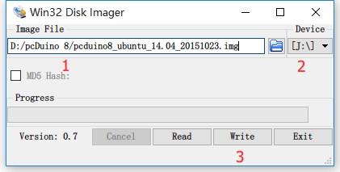
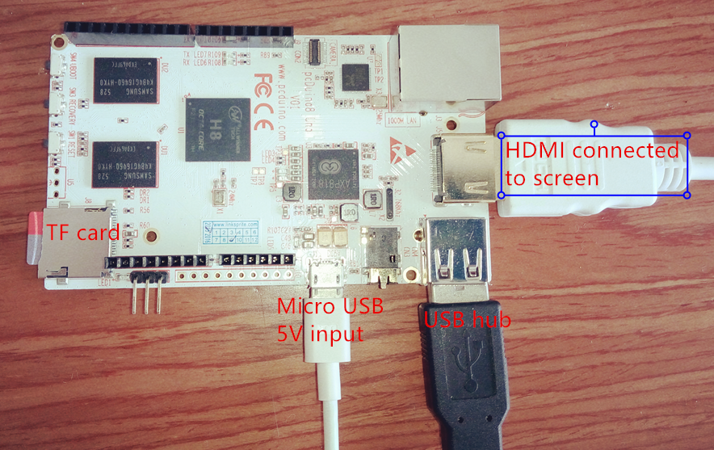

# Create bootable TF card for pcDuino8 Uno(Ubuntu)

If you want to install or refresh the Ubuntu system on pcDuino8 Uno, you can just take the following steps to create the bootable TF card for pcDuino8 Uno:

## Prepare

- 8G (or bigger) TF card( Speed class is recommended for Class 6 or higher )
- TF card reader
- [Image for pcDuino8 Uno](http://www.linksprite.com/?page_id=1496)
- Windows tool: [Win32DiskImager](https://s3.amazonaws.com/pcduino/Tools/win32diskimager-v0.7-binary.zip)

## Create

Plug TF Card Reader into Windows PC and open Win32DiskImager as administrator.

- Select the **Image File** that you unzip from the downloaded File
- Select the **Device** that the PC recognized
- Click the **write** button.
- It will say **Write Successful** at the end.

## Run

- Plug the TF card into pcDuino8 Uno
- Connect 5V DC power input via Micro USB port
- Connect keyboard and mouse with USB hub
- Connect screen with HDMI cable.
- Power on and run

Note: **For the first time boot, system initialization may take some time (about 2-3 minutes ), and USB port is disabled. Please do not shutdown before system restart.**
