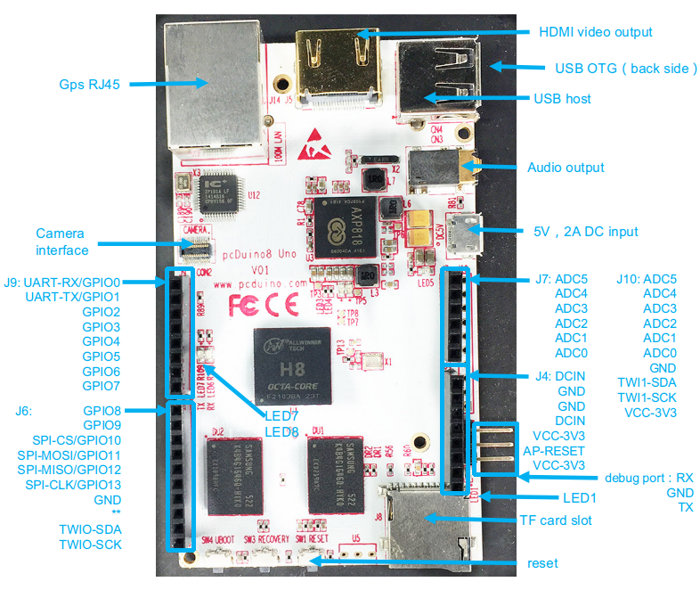
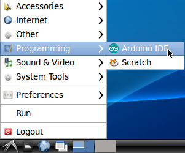

# Arduino Programming Quick Start

pcDuino8 Uno is pin to pin compatible with Arduino so that existing Arduino shields can be installed on pcDuino and many Arduino libraries can run in pcDuino programming environment.



pcDuino8 Uno Image has Arduino IDE built-in.This tutorial will tell how to program GPIO using Arduino IDE.

## Steps(Arduino IDE)
### 1. Open Arduino IDE
Click start menu and open** Programming --> Arduino IDE**.



### 2. Compile and run the example code
When you open the Arduino IDE, you can find a new board type 'pcDuino'.


Take a blink sketch as example. From Menu bar: **File --> Examples --> 01.Basics --> Blink**.


Click this button  to compile and run the source code. Please check the status of LED1, is it blinking?

Note: The compiled binary file is saved at **/home/linaro/Arduino**. So you can manually run this file on Linux terminal.

If you want to create a new design, just enter `Ctrl+n`, and open a window to input source code.

This is the source code, if you have used Arduino before, you will notice that the programming language has no big difference between Arduino and pcDuino.

```c
/*
  Blink
  Turns on an LED on for one second, then off for one second, repeatedly.
  This example code is in the public domain.
 */

// Pin 13 has an LED connected on most Arduino boards.
// give it a name:
int led = 13;

// the setup routine runs once when you press reset:
void setup() {
  // initialize the digital pin as an output.
  pinMode(led, OUTPUT);
}

// the loop routine runs over and over again forever:
void loop() {
  digitalWrite(led, HIGH);   // turn the LED on (HIGH is the voltage level)
  delay(1000);               // wait for a second
  digitalWrite(led, LOW);    // turn the LED off by making the voltage LOW
  delay(1000);               // wait for a second
}
```
