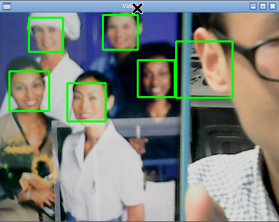

# Face Detection in Python Using pcDuino8 Uno and Webcam

## Introduction

OpenCV is the most popular library for computer vision. It has C++, C, Python and Java interfaces and supports Windows, Linux, Mac OS, iOS and Android.

OpenCV uses machine learning algorithms to search for faces within a picture, and break the task of identifying the face into thousands of smaller, bite-sized tasks. These tasks are called classifiers.

OpenCV uses [cascades](http://docs.opencv.org/modules/objdetect/doc/cascade_classification.html) to implement face detection. Though the theory seems complicated, in practice it is very easy to use.

Thanks to Shantnu Tiwari who give us an example that just has several lines of python code to implement face detection using a webcam.

This post , I follow his steps to do face detection on pcDuino8 Uno.

## Pre-requisites:
* Hardware
 - OpenCV computer vision kit

* Software
 - Ubuntu 14.04
 - Python 2.7.6
 - OpenCV 2.4.11

##  Download the source code
```bash
$ git clone https://github.com/shantnu/Webcam-Face-Detect
$ python webcam.py haarcascade_frontalface_default.xml
```
Note: **Make sure the webcam is recognized as /dev/video0**

I use my mobile phone to show a picture with many faces, the detection result is not bad, although it shows that there are six faces, only five faces are true. Please check the following picture.



## Understand the source code
I add some comments in the source code to help understanding the source code.

```python
import cv2
import sys

cascPath = sys.argv[1]
faceCascade = cv2.CascadeClassifier(cascPath)

# set the video source to webcam which is /dev/video0
video_capture = cv2.VideoCapture(0)

while True:
    # Capture frame-by-frame
    ret, frame = video_capture.read()

   # Convert color to gray, because face detection don't need color
    gray = cv2.cvtColor(frame, cv2.COLOR_BGR2GRAY)

    #Do face detection
    faces = faceCascade.detectMultiScale(
        gray,
        scaleFactor=1.1,
        minNeighbors=5,
        minSize=(30, 30),
        flags=cv2.cv.CV_HAAR_SCALE_IMAGE
    )

    # Draw a rectangle around the faces
    for (x, y, w, h) in faces:
        cv2.rectangle(frame, (x, y), (x+w, y+h), (0, 255, 0), 2)

    # Display the resulting frame with rectangle
    cv2.imshow('Video', frame)

    if cv2.waitKey(1) & 0xFF == ord('q'):
        break

# When everything is done, release the capture
video_capture.release()
cv2.destroyAllWindows()
```
If you have intesting to try this demo, you can the reference[1].

## Reference
1. [Face Detection in Python Using a Webcam](https://realpython.com/blog/python/face-detection-in-python-using-a-webcam/)
